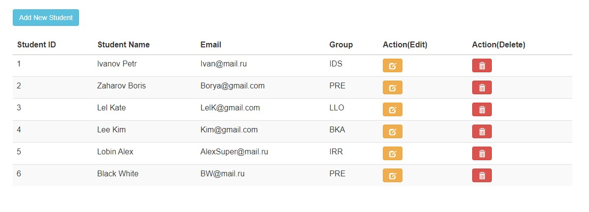
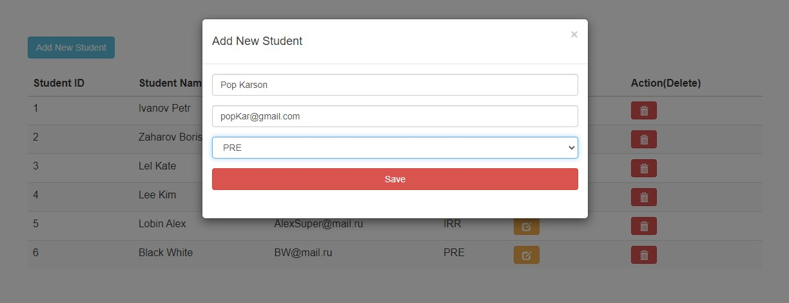
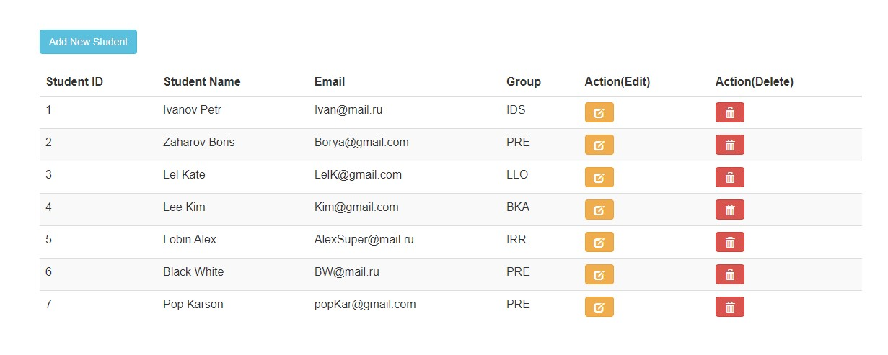
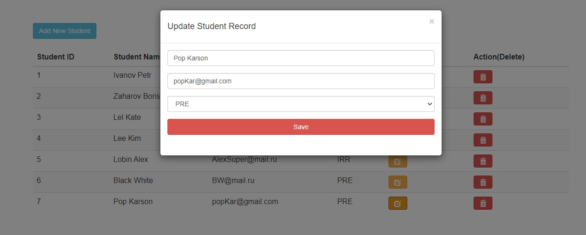
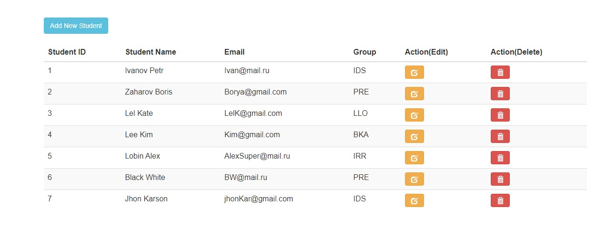
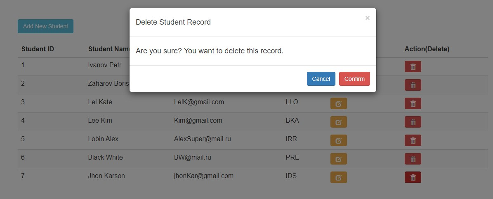
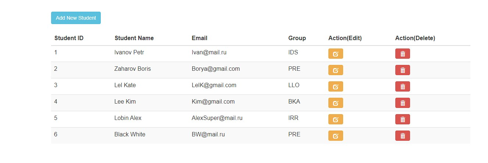

# CRUD
Данное веб приложение создано для учебных целей, направлено на изучение и работу со следующими технологиями: MVC, Entity Framework (Database-First), JavaScript, AJAX...

Приложение представляет собой реализацию CRUD операций (Create, Read, Update, Delete) с сущностями БД - в данном случае со студентами. С помощью ajax все эти операции производятся без перезагрузки страницы.

Целевая платформа - .Net Framework 4.6.1

## Описание работы приложения
При запуске приложения, на главной странице сайта вы увидите всех студентов из БД

В левом верхнем углу на странице можно заметить кнопку голубого цвета с надписью "Add New Student", с помощью которой вы можете добавить в БД нового студента. Нажав на неё на странице появится модальное окно с формой для данных нового студента. Здесь я хочу добавить студента со следующими данными:

Так будет выглядеть обновлённый список студентов после добавления:

Также можно изменить данные студента, нажав на жётлую кнопку в столбце Action(Edit) в строке нужного студента. Изменим данные последнего студента:

После редактирования нас ожидает уже обновлённый список:

Чтобы удалить запись любого студента, вам необходимо щёлкнуть на красную кнопку с корзиной в столбце "Action(Delete)" на строке студента, которого нужно удалить. Удалим последнего добавленного нами студента:

Список после удаления:

Таким образом, данное приложение предоставляет возможности по взаимодейтсвию с базой данных, позволяя добавлять, изменять, удалять данные внутри неё. Всё это реализовано с использованием AJAX, что позволяет обновлять данные на странице сайта без её полной перезагрузки.
